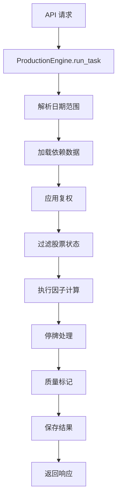
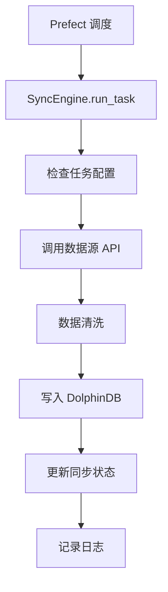

# QuantSystem 架构文档

**版本**: v2.0
**更新日期**: 2026-03-07
**状态**: 重构完成

---

## 目录

1. [系统概览](#系统概览)
2. [分层架构](#分层架构)
3. [核心模块](#核心模块)
4. [数据流](#数据流)
5. [技术栈](#技术栈)
6. [设计模式](#设计模式)

---

## 系统概览

QuantSystem 是一个全栈量化研究平台，提供数据管理、因子计算、回测分析和策略研究功能。

### 核心特性

- **高性能数据处理**: DolphinDB (时间序列数据库) + Polars (向量化计算)
- **工作流编排**: Prefect 3.x 管理数据同步和计算任务
- **模块化架构**: 清晰的分层设计，职责分离
- **类型安全**: 完整的 TypeScript/Python 类型注解
- **不可变数据**: 函数式编程范式，避免副作用

### 系统架构图

```
┌─────────────────────────────────────────────────────────────┐
│                      Frontend (React)                        │
│  DataCenter │ FactorCenter │ BacktestCenter │ StrategyCenter │
└──────────────────────────┬──────────────────────────────────┘
                           │ HTTP/REST API
┌──────────────────────────▼──────────────────────────────────┐
│                    API Layer (FastAPI)                       │
│  /data/* │ /production/* │ /backtest/* │ /strategy/*        │
└──────────────────────────┬──────────────────────────────────┘
                           │
┌──────────────────────────▼──────────────────────────────────┐
│                   Service Layer (业务逻辑)                    │
│  DataService │ FactorService │ BacktestService              │
└──────────────────────────┬──────────────────────────────────┘
                           │
┌──────────────────────────▼──────────────────────────────────┐
│                  Engine Layer (计算引擎)                      │
│  ProductionEngine │ BacktestEngine │ FactorAnalyzer         │
└──────────────────────────┬──────────────────────────────────┘
                           │
┌──────────────────────────▼──────────────────────────────────┐
│                   Data Layer (数据访问)                       │
│  DolphinDBClient │ DataProcessor │ Prefect Flows            │
└──────────────────────────┬──────────────────────────────────┘
                           │
┌──────────────────────────▼──────────────────────────────────┐
│                  Storage Layer (存储)                         │
│  DolphinDB (时序数据) │ File Storage (配置/日志)              │
└─────────────────────────────────────────────────────────────┘
```

---

## 分层架构

### 1. API Layer (API 层)

**职责**: 处理 HTTP 请求，参数验证，响应格式化

**模块结构**:
```
app/api/v1/
├── data/                    # 数据管理 API (39 个端点)
│   ├── query_api.py         # 数据查询 (6 个端点)
│   ├── sync_api.py          # 数据同步 (18 个端点)
│   ├── config_api.py        # 配置管理 (5 个端点)
│   └── etl_api.py           # ETL 任务 (10 个端点)
├── production/              # 因子生产 API (26 个端点)
│   ├── factor_analysis.py   # 因子分析 (6 个端点)
│   ├── factor_compute.py    # 因子计算 (4 个端点)
│   ├── factor_registry.py   # 因子注册 (8 个端点)
│   └── factor_config.py     # 配置管理 (8 个端点)
├── backtest.py              # 回测 API
└── strategy.py              # 策略 API
```

**设计原则**:
- 每个模块 < 600 行代码
- 统一的响应格式 `{success, data, error, timestamp}`
- 完整的 Pydantic 模型验证
- 详细的错误处理和日志记录

### 2. Service Layer (服务层)

**职责**: 业务逻辑编排，事务管理，权限控制

**核心服务**:
- `DataService`: 数据查询和管理
- `FactorService`: 因子计算和分析
- `BacktestService`: 回测执行
- `StrategyService`: 策略管理

**特点**:
- 依赖注入，便于测试
- 事务边界管理
- 业务规则验证

### 3. Engine Layer (引擎层)

**职责**: 核心计算逻辑，算法实现

#### 3.1 ProductionEngine (因子计算引擎)

**位置**: `engine/production/engine.py`

**8 步计算流程**:
```python
1. _resolve_dates()      # 日期解析 (full/incremental)
2. _load_data()          # 数据加载 (根据 depends_on)
3. _apply_adjust()       # 复权处理 (forward/backward)
4. _apply_stock_status() # 状态过滤 (ST/新股/涨跌停)
5. definition.func()     # 因子计算 (用户代码)
6. _handle_suspension()  # 停牌处理
7. _build_quality_flag() # 质量标记
8. _save_results()       # 结果保存 (upsert)
```

**配置驱动**:
- `data_config.py`: 字段映射配置
- `registry.py`: 因子注册和发现
- 支持动态编译用户代码

#### 3.2 FactorAnalyzer (因子分析)

**位置**: `engine/analysis/analyzer.py`

**分析指标**:
- IC (信息系数)
- IR (信息比率)
- 分组收益
- 多空组合
- 换手率

#### 3.3 BacktestEngine (回测引擎)

**位置**: `engine/backtester/`

**功能**:
- 事件驱动回测
- 滑点和手续费模拟
- 风险指标计算

### 4. Data Layer (数据层)

**职责**: 数据访问抽象，查询优化

#### 4.1 DolphinDBClient (重构后)

**位置**: `store/dolphindb/`

**模块化设计** (1934 行 → 6 个模块):
```
dolphindb/
├── __init__.py           # 客户端入口 (委托模式)
├── connection.py         # 连接管理 (单例模式)
├── query_builder.py      # 查询构建 (消除 SQL 拼接)
├── meta_manager.py       # 元数据管理 (表结构)
├── seed_data.py          # 数据初始化
└── data_operations.py    # 数据操作 (CRUD)
```

**关键改进**:
- 单一职责原则
- 线程安全的连接池
- 参数化查询防止 SQL 注入
- 统一的错误处理

#### 4.2 DataProcessor (数据预处理)

**位置**: `data_manager/processor.py`

**预处理选项**:
```python
DEFAULT_PREPROCESS = {
    "adjust_price": "forward",   # 前复权
    "filter_st": True,           # 过滤 ST
    "filter_new_stock": True,    # 过滤新股 (<60天)
    "handle_suspension": True,   # 停牌处理
    "mark_limit": True,          # 标记涨跌停
}
```

#### 4.3 Prefect Flows (工作流)

**位置**: `flows/data_sync_flow.py`

**功能**:
- 定时数据同步
- 任务依赖管理
- 失败重试和告警

---

## 核心模块

### 因子计算流程



### 数据同步流程



---

## 数据流

### 因子计算数据流

```
用户请求
  ↓
API Layer (production/factor_compute.py)
  ↓
Service Layer (FactorService)
  ↓
Engine Layer (ProductionEngine)
  ↓
Data Layer (DolphinDBClient.query)
  ↓
DolphinDB (sync_daily_data, stock_daily_status)
  ↓
Polars DataFrame (向量化计算)
  ↓
DolphinDB (factor_values 表)
  ↓
返回结果
```

### 数据同步数据流

```
Prefect 定时任务
  ↓
Flows (data_sync_flow.py)
  ↓
SyncEngine (refactored_sync_engine.py)
  ↓
数据源 API (Tushare/AKShare)
  ↓
数据清洗和转换
  ↓
DolphinDB (sync_* 表)
  ↓
更新同步日志
```

---

## 技术栈

### 后端

| 组件 | 技术 | 版本 | 用途 |
|------|------|------|------|
| Web 框架 | FastAPI | 0.104+ | REST API |
| 数据库 | DolphinDB | 2.0+ | 时间序列数据 |
| 数据处理 | Polars | 0.19+ | 向量化计算 |
| 工作流 | Prefect | 3.x | 任务编排 |
| 类型检查 | Pydantic | 2.0+ | 数据验证 |
| 日志 | Loguru | - | 结构化日志 |

### 前端

| 组件 | 技术 | 版本 | 用途 |
|------|------|------|------|
| 框架 | React | 18+ | UI 框架 |
| 语言 | TypeScript | 5.0+ | 类型安全 |
| UI 库 | Ant Design | 5.x | 组件库 |
| 状态管理 | React Hooks | - | 本地状态 |
| HTTP 客户端 | Axios | - | API 调用 |

### 基础设施

| 组件 | 技术 | 用途 |
|------|------|------|
| 容器化 | Docker | DolphinDB/Prefect |
| 进程管理 | Shell Scripts | 服务启停 |
| 反向代理 | Nginx (可选) | 生产部署 |

---

## 设计模式

### 1. Repository Pattern (仓储模式)

**目的**: 抽象数据访问，解耦业务逻辑和存储实现

**实现**:
```python
# DolphinDBClient 作为 Repository
class DolphinDBClient:
    def query(self, sql: str, params: tuple) -> pl.DataFrame:
        """统一的查询接口"""
        pass

    def execute(self, sql: str, params: tuple) -> None:
        """统一的执行接口"""
        pass
```

**优势**:
- 业务代码不依赖具体数据库
- 易于切换存储实现
- 便于单元测试 (Mock Repository)

### 2. Factory Pattern (工厂模式)

**目的**: 动态创建因子实例

**实现**:
```python
# registry.py
@factor(factor_id="ma20", depends_on=["close"])
def compute_ma20(df: pl.DataFrame, params: dict) -> pl.Series:
    return df["close"].rolling_mean(window_size=20)

# 使用
definition = get_factor("ma20")
result = definition.func(df, definition.params)
```

### 3. Strategy Pattern (策略模式)

**目的**: 可配置的预处理策略

**实现**:
```python
# processor.py
class DataProcessor:
    def preprocess(self, df: pl.DataFrame, options: dict) -> pl.DataFrame:
        if options.get("adjust_price"):
            df = self._apply_adjust(df, options["adjust_price"])
        if options.get("filter_st"):
            df = self._filter_st(df)
        return df
```

### 4. Singleton Pattern (单例模式)

**目的**: 全局唯一的数据库连接

**实现**:
```python
# connection.py
class DolphinDBConnection:
    _instance = None
    _lock = threading.Lock()

    def __new__(cls):
        if cls._instance is None:
            with cls._lock:
                if cls._instance is None:
                    cls._instance = super().__new__(cls)
        return cls._instance
```

### 5. Facade Pattern (外观模式)

**目的**: 简化复杂子系统的接口

**实现**:
```python
# DolphinDBClient 作为 Facade
class DolphinDBClient:
    def __init__(self):
        self._connection = DolphinDBConnection()
        self._query_builder = QueryBuilder(self._connection)
        self._meta_manager = MetadataManager(self._connection)
        # ... 其他组件

    # 提供统一的简单接口
    def query(self, sql, params):
        return self._query_builder.query(sql, params)
```

---

## 关键数据表

### 因子相关表

| 表名 | 用途 | 主键 |
|------|------|------|
| `factor_metadata` | 因子定义 | factor_id |
| `factor_values` | 因子值 | (ts_code, trade_date, factor_id) |
| `factor_analysis_results` | 分析结果 | analysis_id |
| `factor_data_config` | 字段映射 | config_id |

### 数据同步表

| 表名 | 用途 | 主键 |
|------|------|------|
| `sync_daily_data` | 日线行情 | (ts_code, trade_date) |
| `sync_adj_factor` | 复权因子 | (ts_code, trade_date) |
| `stock_daily_status` | 每日状态 | (ts_code, trade_date) |
| `sync_task_config` | 任务配置 | task_id |
| `sync_task_log` | 同步日志 | log_id |

---

## 配置管理

### 环境变量 (.env)

```bash
# DolphinDB
DOLPHINDB__HOST=localhost
DOLPHINDB__PORT=8848
DOLPHINDB__USERNAME=admin
DOLPHINDB__PASSWORD=123456

# Prefect
PREFECT_API_URL=http://localhost:4200/api

# 应用配置
LOG_LEVEL=INFO
ENVIRONMENT=development
```

### 字段映射配置

**位置**: `factor_data_config` 表

**用途**: 统一不同数据源的字段名

```json
{
  "close": "close_price",
  "volume": "vol",
  "amount": "turnover"
}
```

---

## 性能优化

### 1. 数据库层面

- **分区表**: 按日期分区，加速范围查询
- **索引**: ts_code + trade_date 复合索引
- **批量操作**: 使用 `tableInsert` 批量写入

### 2. 计算层面

- **Polars 向量化**: 避免 Python 循环
- **惰性求值**: 使用 Polars LazyFrame
- **并行计算**: 多因子并行计算

### 3. API 层面

- **分页查询**: 限制单次返回数据量
- **缓存**: 缓存元数据和配置
- **异步 IO**: FastAPI 异步端点

---

## 安全性

### 1. SQL 注入防护

- 使用参数化查询 (`%s` 占位符)
- 禁止直接拼接 SQL 字符串

### 2. 代码沙箱

- 因子代码在受限环境执行
- 禁止访问文件系统和网络
- 超时保护

### 3. 权限控制

- API 认证 (待实现)
- 操作审计日志

---

## 可扩展性

### 1. 添加新数据源

1. 在 `data_manager/` 创建新的 Adapter
2. 在 `sync_task_config` 添加配置
3. 在 Prefect Flow 注册任务

### 2. 添加新因子

1. 在 `engine/factors/` 实现计算逻辑
2. 使用 `@factor` 装饰器注册
3. 通过 API 或数据库添加元数据

### 3. 添加新分析指标

1. 在 `engine/analysis/` 实现分析逻辑
2. 在 `factor_analysis.py` 添加端点
3. 更新前端展示组件

---

## 监控和日志

### 日志级别

- **DEBUG**: 详细的调试信息
- **INFO**: 关键操作记录
- **WARNING**: 潜在问题
- **ERROR**: 错误和异常

### 日志位置

- 应用日志: `backend/logs/app.log`
- Prefect 日志: Prefect UI
- DolphinDB 日志: DolphinDB 日志目录

### 监控指标

- API 响应时间
- 因子计算耗时
- 数据库查询性能
- 内存使用情况

---

## 部署架构

### 开发环境

```
localhost:3000  → React Dev Server
localhost:8000  → FastAPI (uvicorn)
localhost:8848  → DolphinDB
localhost:4200  → Prefect UI
```

### 生产环境 (推荐)

```
Nginx (80/443)
  ↓
  ├─→ React (静态文件)
  └─→ FastAPI (Gunicorn + Uvicorn Workers)
        ↓
        ├─→ DolphinDB Cluster
        └─→ Prefect Server
```

---

## 参考资料

- [FastAPI 文档](https://fastapi.tiangolo.com/)
- [Polars 文档](https://docs.pola-rs.com/)
- [DolphinDB 文档](https://www.dolphindb.com/docs/)
- [Prefect 文档](https://docs.prefect.io/)
- [项目 API 文档](./API.md)
- [开发者指南](./DEVELOPER_GUIDE.md)
